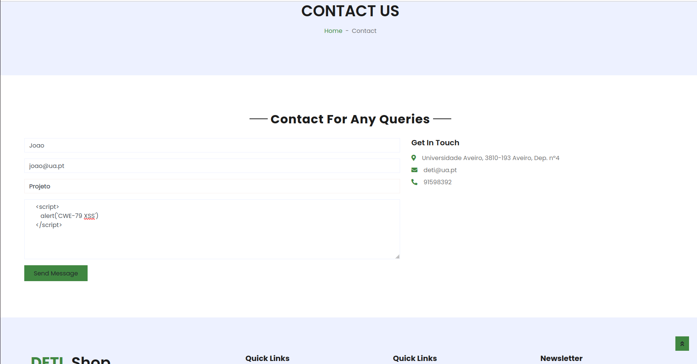
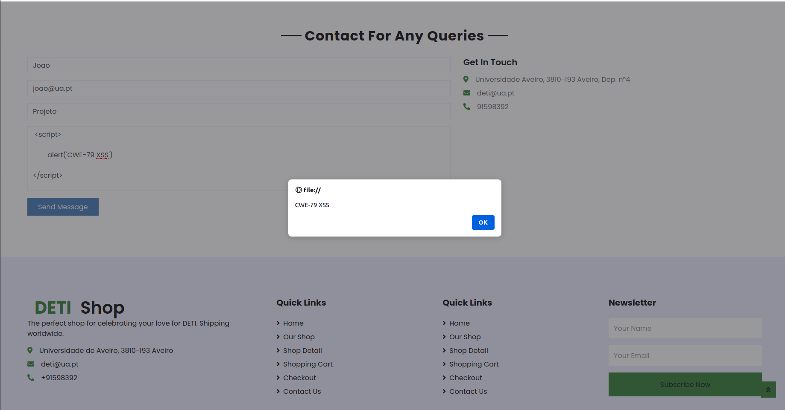
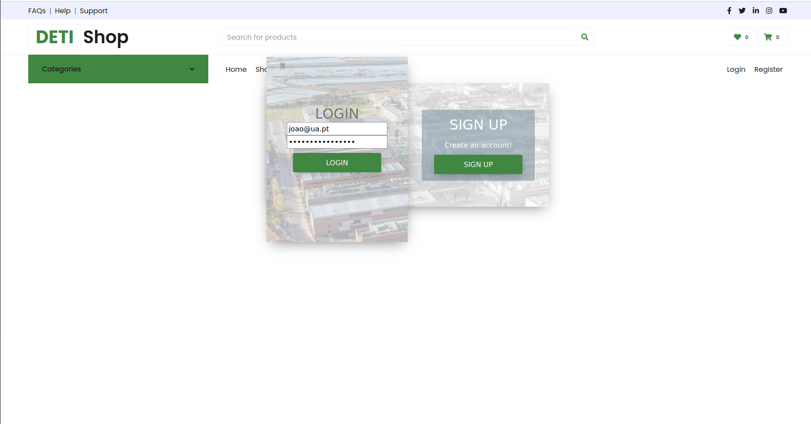
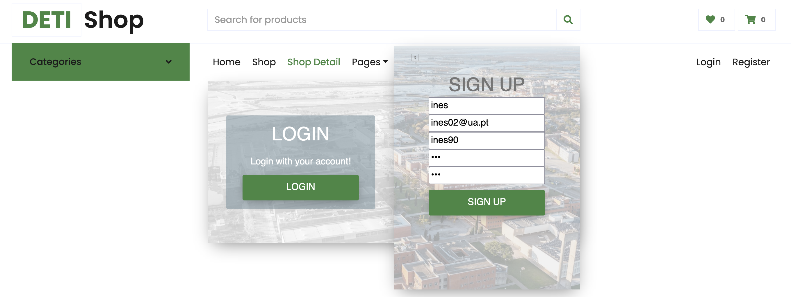

## Análise de vulnerabilidades

### CWE-79: Improper Neutralization of Input During Web Page Generation ('Cross-site Scripting')

#### Descrição:
Cross-site Scripting é uma vulnerabilidade que permite que um atacante execute scripts do lado do cliente, em páginas Web. Quando outros utilizadores carregam as páginas afetadas, os scripts maliciosos são executados pelo browser. Com isto, o atacante consegue aceder facilmente a cookies, tokens de sessões, entre outras informações.

Na página *contact* da nossa aplicação, o utilizador insere um texto, que será exibido na própria página, sem qualquer tratamento.

### Ataque: injetar um script na página *Feedback*
### Passo 1
Aceder à página dos "contact" e inserir código JavaScript delimitado pelas tags ```<script>``` e ```</script>```.

### Passo 2
Send Message.




### Resultado


Sempre que um utilizador entrar na página, o código JavaScript é executado. No exemplo, é apresentada uma *alert box* com o conteúdo "CWE-79 XSS".


<br>

### CWE-89: Improper Neutralization of Special Elements used in an SQL Command ('SQL Injection')
#### Descrição
SQL Injection é uma vulnerabilidade que permite que um atacante injete código SQL malicioso numa *query*, por intermédio de inputs, cujos valores são guardados numa base de dados relacional. Além disso, os comandos que precedem o código injetado podem ser neutralizados, comprometendo a segurança do sistema, nomeadamente no processo de autenticação.

Está presente na pagina login do website:

## Ataque: login sem credenciais válidas

### Passo 1
Aceder à página de login e inserir um email existente e no campo 'Password' o seguinte excerto de código SQL:
```sql
' or 1=1 ) -- //
```



### Passo 2
Submeter o formulário de login.


### Resultado
É executado o seguinte comando SQL:
```sql
SELECT * FROM User WHERE ( email = '[RANDOM_MAIL]' ) AND ( password_ = '' OR 1=1 ) -- // ) "
```
equivalente a
```sql
SELECT * FROM User WHERE ( email = '[RANDOM_MAIL]' ) AND 1
```
equivalente a
```sql
SELECT * FROM User WHERE ( email = '[RANDOM_MAIL]' )
```

O atacante entra na conta, mesmo desconhecendo a password da vítima.

<br>


### CWE-521: Weak Password Requirements
A vulnerabilidade de "Weak Password Requirements" ocorre quando um sistema não possui um mecanismo adequado para verificar a complexidade e a segurança das senhas escolhidas pelos usuários. Isto significa que, na página de registo, não há uma verificação para garantir que a senha inserida pelo usuário seja forte o suficiente. Se o usuário escolher uma senha muito simples, isso pode tornar mais fácil para um atacante usar técnicas de força bruta para tentar adivinhar a senha e obter um acesso não autorizado. Esta falha ressalta que a segurança de um sistema não depende apenas de sua implementação, mas também do comportamento dos próprios usuários ao escolherem suas senhas.



